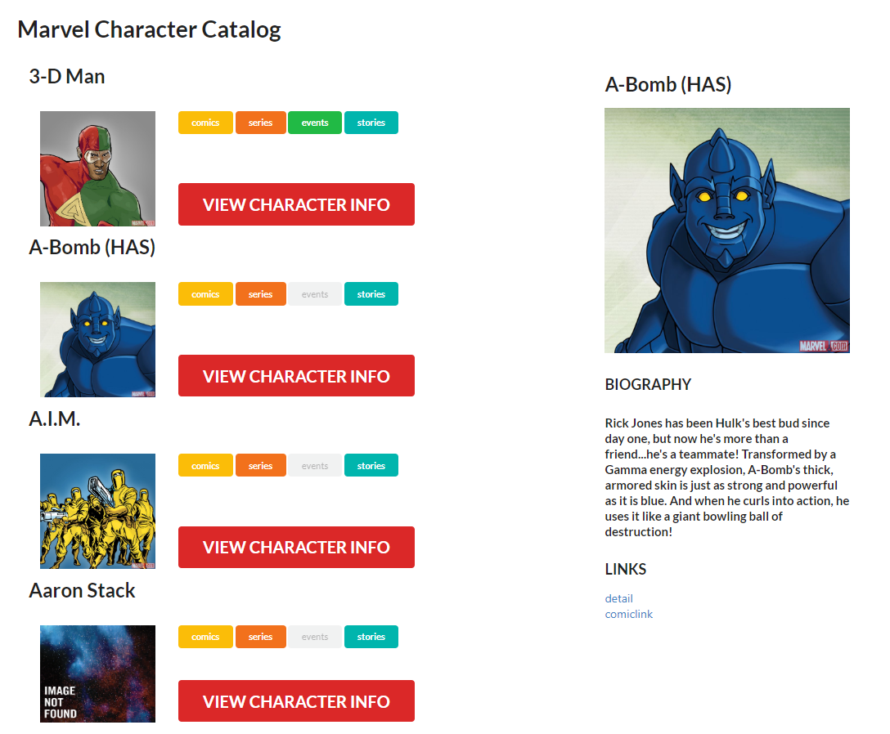

# React Marvel Catalog


This is a sample React app which demonstrates how I uses the marvel API with Redux to show a list of marvel characters and a detailed view of a selected character.

## Libs
 - [Redux](http://redux.js.org/)
 - [Moment](https://momentjs.com/)
 - [Semantic UI React](https://react.semantic-ui.com)
---
## Screenshot


## Functionalities
 - A list of characters loaded from the marvel API
 - Each character has a button to display the info

 ## Get started

 ```
 $ git clone https://github.com/erevol/react-redux-marvel
 $ cd react-marvel-catalog
 $ npm install
 $ npm start
 ```

This project was bootstrapped with [Create React App](https://github.com/facebook/create-react-app).